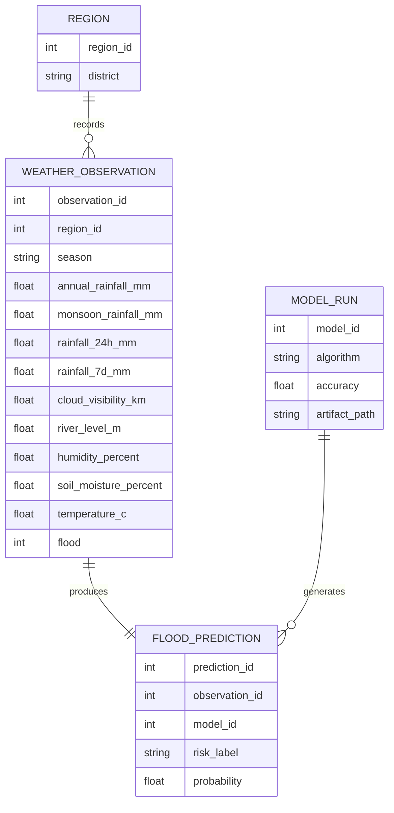
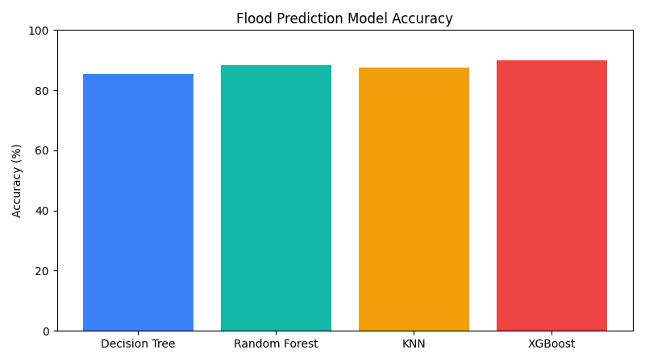

# Flood Prediction System

Floods are among the most damaging natural disasters because communities often receive warnings too late. This project builds a machine learning-powered flood prediction system that uses historical and current weather indicators to classify whether a region is at high or low flood risk.

The system trains Decision Tree, Random Forest, K-Nearest Neighbours, and XGBoost classifiers on rainfall, cloud visibility, river, humidity, soil moisture, temperature, district, and seasonal features. The best-performing model is saved and used by a Flask web application for instant flood risk prediction.

## Entity Relationship Diagram



## Pre-requisites

Hardware requirements:

- Processor: Intel i3 or above
- RAM: Minimum 4 GB
- Storage: Minimum 2 GB free space
- Internet connection for cloud deployment or dependency installation

Software requirements:

- Python 3.8 or above
- Flask
- NumPy
- Pandas
- Matplotlib
- Scikit-learn
- XGBoost
- HTML, CSS, JavaScript-ready browser
- IBM Cloud account for optional deployment

Install dependencies:

```bash
pip install -r requirements.txt
```

## Project Flow

1. Collect or generate historical weather data.
2. Explore rainfall, visibility, river level, and seasonal patterns.
3. Preprocess numerical and categorical features.
4. Train multiple supervised learning classifiers.
5. Compare accuracy and save the best model.
6. Load the saved model inside Flask.
7. Enter regional weather readings and receive flood risk predictions.

## Epic 1: Data Collection

The project uses `src/generate_dataset.py` to create a sample historical weather dataset at `data/flood_weather_data.csv`. The dataset includes district, season, annual rainfall, monsoon rainfall, 24-hour rainfall, 7-day rainfall, cloud visibility, river level, humidity, soil moisture, temperature, and the target label `flood`.

Run:

```bash
python src/generate_dataset.py
```

## Epic 2: Visualizing and Analysing the Data

The training script creates a model accuracy chart at `static/model_accuracy.png`. The dataset can also be analysed in Jupyter Notebook or Anaconda Navigator using Pandas and Matplotlib to study rainfall distribution, flood counts, and relationships between weather variables.



Suggested analysis:

- Flood and non-flood class balance
- Rainfall against flood outcome
- Cloud visibility against flood outcome
- Seasonal flood frequency
- Correlation between river level, soil moisture, and flood risk

## Epic 3: Data Pre-processing

The preprocessing pipeline is built with Scikit-learn:

- Numerical columns are scaled using `StandardScaler`.
- Categorical columns such as district and season are encoded using `OneHotEncoder`.
- The pipeline is fitted only on training data to avoid data leakage.
- Train and test sets are split with stratification to preserve class balance.

## Epic 4: Model Building

The following supervised classification algorithms are trained and compared:

- Decision Tree
- Random Forest
- K-Nearest Neighbours
- XGBoost

Run:

```bash
python src/train_model.py
```

The best model is saved to `models/best_flood_model.joblib`, and the evaluation report is saved to `models/model_report.txt`.

## Epic 5: Application Building

The Flask application in `app.py` loads the saved model and provides an accessible prediction interface. Users enter rainfall, cloud visibility, river, humidity, soil moisture, temperature, district, and season values. The app returns:

- Flood risk classification
- Flood probability
- Best model name
- Test accuracy

Run:

```bash
python app.py
```

Open:

```text
http://127.0.0.1:5000
```

## Deployment on IBM Cloud

The project can be deployed as a Python Flask application on IBM Cloud Code Engine, Cloud Foundry, or a container-based service. Include the repository files, install `requirements.txt`, train the model before deployment, and start the app with `python app.py` or a production WSGI server.

## Conclusion

This project demonstrates how machine learning can improve flood early-warning workflows. By combining weather history, seasonal rainfall, visibility, and river readings, the system helps meteorologists, government analysts, and disaster response teams classify flood risk quickly and plan evacuation or resource allocation more effectively.
